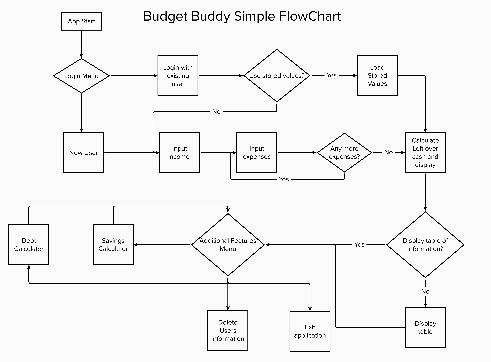
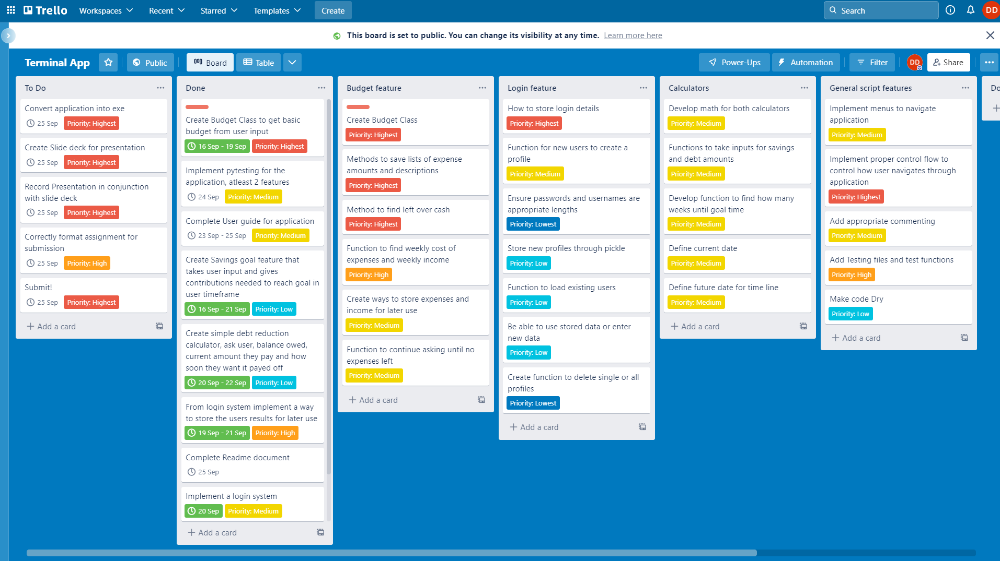

# T1A3 - Your Personal Budget Buddy

### *By Dale Dahlenburg*

[App repository found here!](https://github.com/daledburg/terminal_application)

---
## Code styling guide/styling conventions
The styling guide that I decided to follow when creating this application was PEP 8. This code relates directly to Python and provides coding conventions for the standard Python libraries. It has been developed from the original Python Style guide written by the Python Creator Guido van Rossum.
[PEP 8 Stlye Guide](https://peps.python.org/pep-0008/) (peps.python.org, n.d.)

---

## Implementation plan

The idea a budget application was always my first choice when thinking about where to take this assignment. Personally the idea of having an easy to use application to manage my budget appealed to me as something I could envision using in everyday life. The target audience is therefore people like myself, who would like a simple and clean way to display their financial information and be able to make informed decisions about creating a budget that works for them.

The first step after deciding to go ahead with my idea was to create an implementation plan to ensure the important features of the project were prioritised. To accomplish this a applicaion called Trello was used. A trello board is a way to add all of the tasks for the upcoming project and be able to visually display the breakdown with due dates, and priority descriptions. The most important feature for the application was the budget inputs and calculations, therefore I decided to focus my immediate focus on developing classes and functions that would take inputs from the user and return a value to show how much money the user had left over. The next step was to decide how to display this data in a graphical way for the users interpretation. This was decide to be a table and the development of that led to other features taking shape, such as the savings and debt calculator. From here the task of creating a login function that saved all of this user input had to be created.

First for the implementation plan was to create a basic flow chart of how the program should flow to be able to steer my thoughts in the right direction. This flowchart allowed me to break down the project into smaller more manageable parts that was shown in a more easily understandable visual way. This information could then be entered into a Trello board to provide another way to track progress. A copy of this flowchart can be seen here:

### **FlowChart**
\


This implementation plan was developed in a trello board that I created. As can be seen below, there were several different tasks to be completed. The main features of the application were then also broken down into smaller tasks so as to increase the effficiency of development. Tasks were given level of importance as well as some of the tasks given my own due dates that I set for what I thought I would need to complete the task on time.

### **Trello Board**

\


---

## Purpose of design

This application is being designed as a bash-terminal based application using python. The goal in creating this application is to provide a useful tool for users to be able to understand their financial situation and provide facts and figures in an easy to understand way to help users make smarter financial decisions. It has multiple features to provide an array of different kinds of information that the user may want, while also providing the ability for the user to create their own profile to store this information for recall at a later date.

---

## Key Features

- ### **Login feature**

    This application provides two different login methods when starting. First of all is 'Register' for new users to create their own unique Username and Password. The script accomplishes this through the use of dictionaries and the python package Pickle. To do this a file where the login information is opened, the new User is then prompted to create a Username and a Password. From there the script takes these values and assigns the username input as the key, and the password input as the value in a dictionary that is saved into the open file. This file can then be accessed in further uses of the application and these inputs can be accessed to check if the password entered corresponds to the valid value for password.

    The username that is created is then used to save the budget data for later recall. The user data that is entered for the income, descriptions of expenses and amounts of expenses a new file is created. This new file is named using a pre-determined string that is concatenated with the username to create the new file name. When a user logs in at a later date this information can be retrieved by re-opening the file name that has the corresponding username information in the file name and loading the information using pickle load.

    The user also has the option to delete their user profile later on in the application. As the information is stored in files with the username information attached, it is easy enough to delete those files that are related to the user. The user can also delete all of the files if the master password is entered. As the system of creating new files for each user is not perfect, this provides a way to clean up the program if too many users have been created.

- ### **Budget**
  
    The budget feature itself is main function of the project. Once the user has created a profile, it begins asking questions, starting with the income of the user and then following on to the regular expenses that the user may have. Both the income and expenses also asks how regular the payments are so that the script can convert the values into weekly values that can be easily compared. This aspect of the feature allows the application itself to do most of the heavy lifting for the data analysis as it will convert the data into a weekly breakdown and printing a message that indicates the amount of money that is left over each week. This script utilises constant error handling with the while True, try, except model so that the program isn't derailed by any untoward errors caused by the user entering information in incorrect formats.

- ### **Graphical table to show information**

    Then next feature that adds value for the user is a table that can be displayed. After the user finishes entering their budget information they have the option to visually display a table using the python package PrettyTable. The information is broken down into two columns: description of the values and the values themselves. The income value is displayed at the top of the columns as positive numbers, while the expenses are shown as negative numbers. The last values that are shown at the bottom of the table is the left over money that has been previously calculated. This provides a clear and visual representation to the user to help them make informed decisions regarding their budget.

- ### **Savings and Debt calculators**

    The next two features that were added were similar in that they are calculators to be able to help users who want to save a certain amount by a particular date or attempt to pay off an outstanding debt in a different timeframe. Both of these features use the datetime package to import the current date so as to calculate the amount of time between today's date and the future date entered by the user. The savings goal asks for a goal, followed by when the user would like to accomplish this by, it then prints a message displaying how much money they need to save each week to reach this goal. The debt calculator on the other hand takes the input of how much is left to pay and asks how much money they are currently contributing. From this it will calculate how much more or less they need to contribute to reach the date goal they have set. Again all of these inputs have error handling implemented to ensure that users arent able to break the application through there inputs.

---

## Modules Used

### Inbuilt modules

- datetime
- time
- sys
- pickle
- os

### PyPi Packages installed

- Pyfiglet
- Clearing
- simple_term_menu
- prettytable
- pytest

---

## Help Documentation

*This documentation can also be found in the docs folder.*

This program requires the following dependencies to be able to be installed and run:

- The user must have python installed on their system. Please visit [Python Installer](https://www.python.org/downloads/) and follow the instructions to install if this isnt up to date.
- The user must also have Git installed on your system. Please visit [Python Installer](https://www.python.org/downloads/) and follow the instructions to install if this isnt already installed.

---

1. Once your system is up to date, the next step is to clone the repository from my personal Github repository using the following command in the terminal:

```bash
git clone https://github.com/daledburg/terminal_application.git
```

2. Next while in the directory where the repository has been cloned, navigate to the src/dist folder where the executabl is located:

```bash
cd src/dist
```

3. From here, run the the program using:

```bash
./budget_buddy
```

4. This starts the application, from here follow onscreen instructions and enjoy!

---
## Reference:

- peps.python.org. (n.d.). PEP 8 – Style Guide for Python Code | peps.python.org. [online] Available at: https://peps.python.org/pep-0008/.
